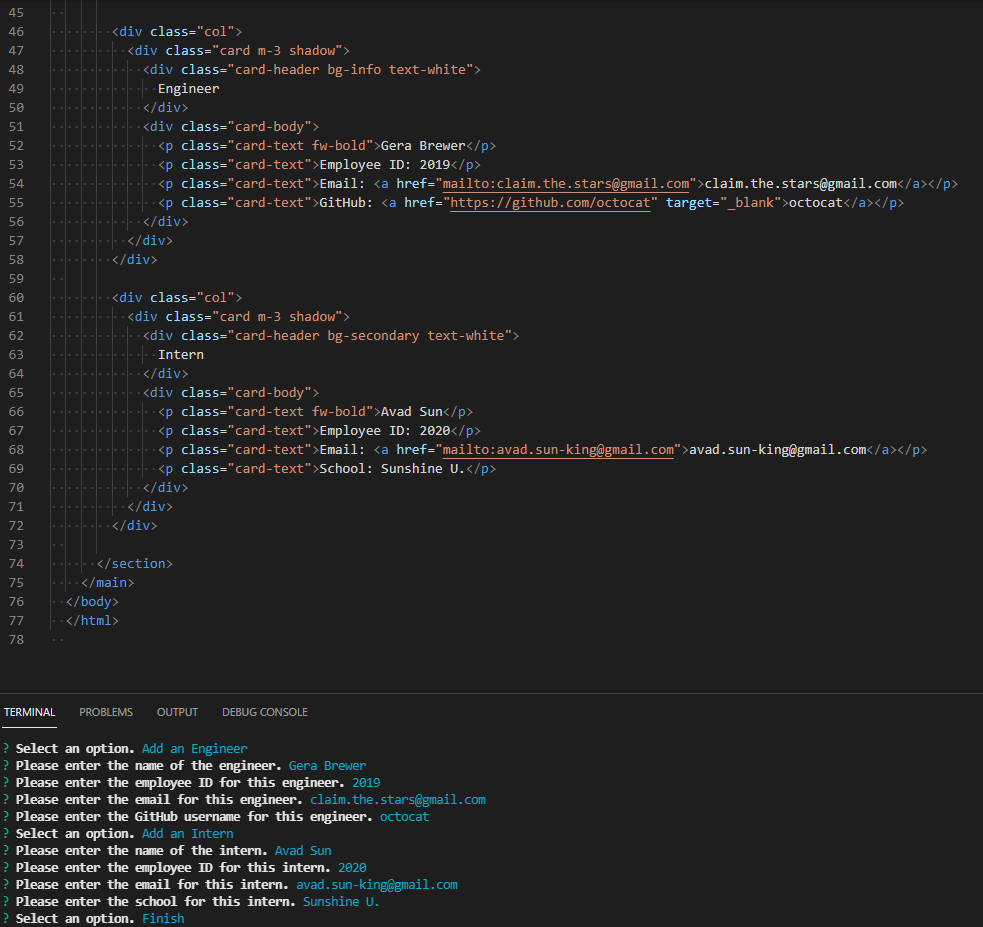
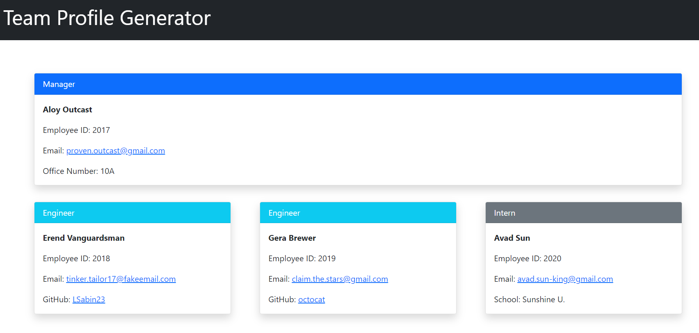

# jest-another-team-inquiry

## Description
Ever wanted to organize your team members in a neat fashion? Well, now you can with jest-another-team-inquiry! By answering the prompts on members of your team, you can have a functional and organized page generated showing you relevant information on your team members with clickable links to send emails or access GitHub accounts!

_App Sample Screenshots_

### Access

Clone the repository to your local machine, navigate to the root directory of the repository, then run "node index.js" from the command line.

[Demo Video](https://watch.screencastify.com/v/x5DShTZTV9WgGy3HpdSJ)

### Future Enhancements Roadmap

* add additional employee type options
* add additional styling for an even fancier experience
***
Please note, some of the information used in the samples was borrowed from the [Horizon Zero Dawn videogame](https://www.guerrilla-games.com/play/horizon).
